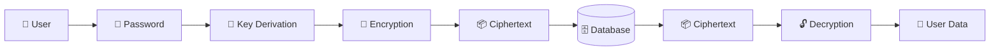
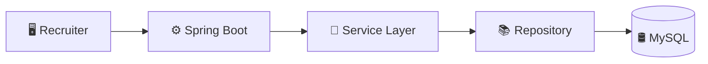
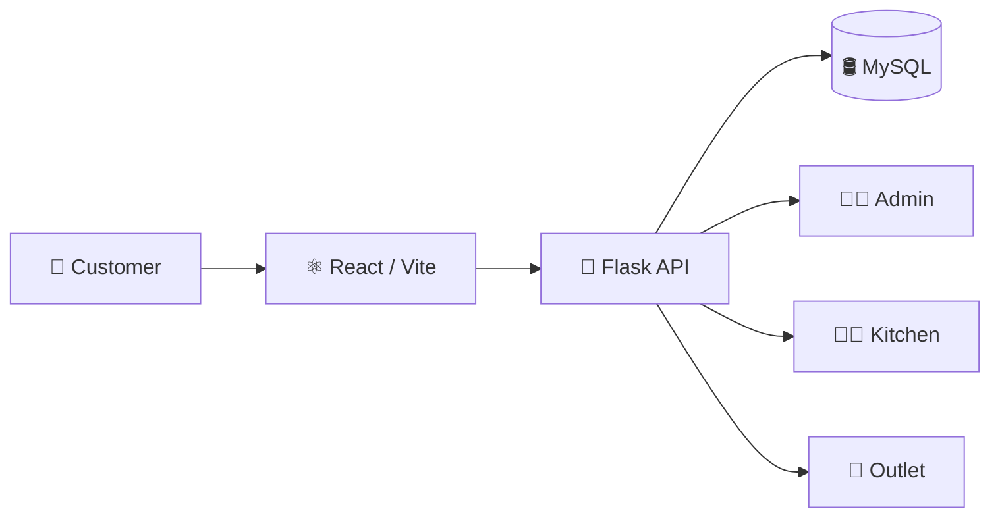
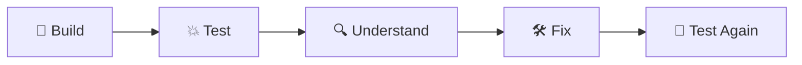
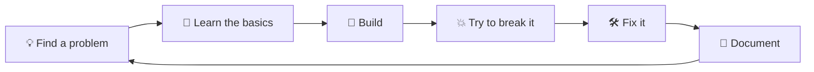

## 👋 About Me

I'm **Neeraj**, a **Computer Science graduate from KL University**, with a **B.Tech in CSE (2026)** and a **CGPA of 9.33**.

I mainly work with **Java, Spring Boot, Python and Flask**, with a strong interest in **backend development, REST APIs and application security**.

I enjoy understanding what happens behind the screen — how a request moves through an API, how data reaches a database, how authentication works, and what happens when someone tries to break those assumptions.

I've built projects around **secure data storage, recruitment systems, food ordering and network monitoring**, while also spending time learning cybersecurity through hands-on labs.

I'm currently looking for a **full-time fresher / graduate role in backend development**, especially roles involving **Java, Spring Boot, APIs and secure systems**.

## 🧰 Skills

 

|     | Skill                                     | Where I've used it                                                                 |
| :-: | ----------------------------------------- | ---------------------------------------------------------------------------------- |
|  ☕  | **Java · Spring Boot**                    | RecruiterService — backend APIs, business logic and MySQL integration              |
|  🐍 | **Python · Flask**                        | ZK-Vault, food-ordering backend and cybersecurity projects                         |
|  🔐 | **Application Security**                  | Authentication, authorization, secure sessions, input validation and security labs |
|  🌐 | **REST APIs**                             | Spring Boot and Flask backend projects                                             |
| 🗄️ | **MySQL · PostgreSQL · Redis**            | Relational data, application persistence and temporary state                       |
|  ⚛️ | **React · JavaScript · HTML · CSS**       | Food-ordering interfaces and web dashboards                                        |
|  🐳 | **Docker · Linux · Git · GitHub Actions** | Development, packaging and project workflows                                       |
|  ☁️ | **AWS · GCP**                             | Cloud learning, deployment and cloud fundamentals                                  |

### Other tools I work with

**Postman · JUnit · Maven · GitHub Actions · JSP · Bootstrap · Nginx · Linux**

**Certification:** AWS Certified Cloud Practitioner (CLF-C02)

## 🛠️ What I Built

### 🔐 ZK-Vault — Private Data Vault

**The idea:**
What if the server could store your data without being able to read it?

ZK-Vault is my exploration of building a secure personal data vault where sensitive information is encrypted before it can be exposed to the normal application data layer.

* Built with **Python / Flask**
* Uses **Argon2id** for password-based key derivation
* Uses **AES-GCM** for authenticated encryption
* Designed around keeping plaintext sensitive data away from the server
* Uses **MySQL** for persistent storage
* Uses **Redis** for temporary state
* Includes security considerations around sessions, rate limiting, CSRF and secure headers

**What it taught me:**
Encryption alone doesn't make a system zero-knowledge. The important part is deciding **what the server is allowed to know, what it must never receive, and where keys exist**.

🔗 [ZK-Vault](https://github.com/neerajsait/ZK-Vault)

---

### 💼 RecruiterService — Recruitment Management System

**The idea:**
A recruitment system that gives recruiters a structured way to manage jobs and applicants instead of relying on scattered spreadsheets and messages.

* Built using **Spring Boot**
* **Hibernate / JPA** for database interaction
* **MySQL** for persistence
* **JSP + HTML/CSS** for the recruiter interface
* Recruiter registration and login
* Recruiter dashboard
* Job creation and management
* Applicant and interview status management
* Email notifications using JavaMail
* Session-based recruiter workflow

My contribution is focused on the **Recruiter module**, including recruiter registration/login, dashboard functionality and job-management workflows.

**What it taught me:**
How to structure a Java backend into **controllers, services and repositories**, while connecting the backend to a relational database and an actual user interface.

🔗 [RecruiterService](https://github.com/neerajsait/RecruiterService)

---

### 🍱 Food Ordering Platform — Suggula's Kitchen

**The idea:**
A real food-ordering application built for a food business, connecting customers, administration, kitchen and outlet workflows.

* **React + Vite** frontend
* **Flask** backend
* **MySQL** database
* Customer ordering workflow
* Cart and checkout
* Admin management
* Kitchen workflow
* Outlet-related operations
* Product and category management
* Order management
* Delivery-charge handling
* Deployment work involving **Netlify and Supabase**

The project also pushed me to think about real-world backend issues such as **server-side validation, database relationships, authentication and protecting values received from the client**.

**What it taught me:**
A real application is more than an API or a UI. The difficult part is connecting **frontend → backend → database → business rules** without trusting the client with decisions that belong on the server.

🔗 [Food Project](https://github.com/neerajsait/food)

---

### 📡 Network Monitor — Network Visibility Dashboard

**The idea:**
A web-based interface for displaying network information and making network activity easier to understand than raw terminal output.

* Built as a web dashboard using **HTML, CSS and JavaScript**
* Focused on presenting network information through a browser interface
* Helped me understand how system/network information can be collected and represented visually

**What it taught me:**
How to turn low-level technical information into something that can be understood through a clean interface.

🔗 [Network Monitor](https://github.com/neerajsait/Network-Monitor)

---

### 🛡️ Cybersecurity Projects — Learn by Breaking and Fixing

I learn security by **building vulnerable examples, attacking them in a controlled environment, understanding the weakness and then fixing it**.

Areas I've explored include:

* Authentication and authorization weaknesses
* Injection vulnerabilities
* Authentication bypass
* Secure session handling
* Input validation
* Web application security
* OWASP-related concepts
* Network and security fundamentals

**What it taught me:**
Thinking about how an application can fail makes me more careful about how I design backend code.

🔗 [Cybersecurity Projects](https://github.com/neerajsait/cybersecurity-projects)

## 🔄 How I Work

I don't want to stop at **"it works."**

I try to understand **why it works, how it can fail, and what happens when someone sends something I didn't expect**.

That mindset is one of the main reasons I've become interested in the overlap between **backend development and cybersecurity**.

## 📈 My Journey

|     | Stage               | What changed                                                                           |
| :-: | ------------------- | -------------------------------------------------------------------------------------- |
|  🌱 | **Programming**     | Started with programming fundamentals and gradually moved into Java and Python         |
|  🌐 | **Web Development** | Learned HTML, CSS and JavaScript and started building web applications                 |
|  ☕  | **Backend**         | Moved deeper into Java, Spring Boot, REST APIs and MySQL                               |
|  🔐 | **Security**        | Started exploring application security, cryptography and security testing              |
| 🛠️ | **Real Projects**   | Built projects connecting frontend, backend, databases and real business workflows     |
|  🚀 | **Now**             | Strengthening Java/Spring Boot, backend architecture, APIs and cybersecurity knowledge |

## 🎯 What I'm Looking For

I'm looking for a **full-time fresher / graduate software engineering role** where I can work on real backend systems and learn from experienced engineers.

### Roles I'm targeting

* **Java Developer**
* **Spring Boot Developer**
* **Backend Engineer**
* **Software Development Engineer / SDE-1**
* **Graduate Engineer Trainee – Technology / API Development**

I'm particularly interested in work involving:

**Java · Spring Boot · REST APIs · Backend Systems · Databases · Distributed Systems · Application Security**

## 📚 Currently Learning

* Advanced **Java**
* **Spring Boot** and backend architecture
* **REST API design**
* **Kafka and event-driven systems**
* **Application security**
* **Cybersecurity fundamentals**
* **Cloud and deployment**
* Research fundamentals for **AI + Cybersecurity**

I'm less interested in collecting technologies and more interested in understanding **how they actually work together in a real system**.

## 📬 Let's Talk

