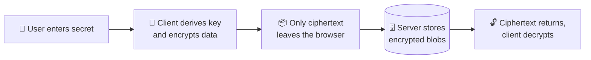
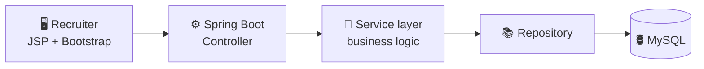
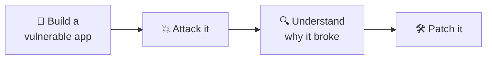
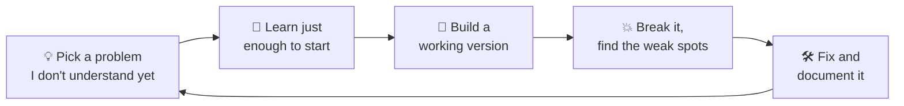

<!-- Paste into README.md of your repo named exactly: neerajsait/neerajsait -->
<!-- Search for ✏️ and fill in your real details. Delete any line that isn't true. -->

## 👋 About Me

I'm **Neeraj**, a Computer Science student at **KL University** who enjoys the part of software where mistakes are expensive: authentication, privacy, and systems that must keep working while someone is trying to break them.

My main tool is **Java with Spring Boot**. Around it I've built a **zero-knowledge vault**, **security labs**, a **network monitor** and a **food-ordering app**, which taught me how a real product connects from the screen down to the database.

> ✏️ *Add one personal line: what made you start coding, or what you want to build next.*

## 🧰 Skills

 

| | Skill | Where I've used it |
|:---:|---|---|
| ☕ | **Java · Spring Boot** | RecruiterService: layered REST backend with MySQL |
| 🐍 | **Python** | ZK-Vault and the cybersecurity labs |
| 🔐 | **Security & cryptography** | Zero-knowledge storage, injection and auth-bypass labs |
| 🌐 | **JavaScript · HTML · CSS** | FoodPilot and the Network-Monitor dashboard |
| 🐳 | **Docker · Linux · AWS · Git** | Packaging, running and shipping my projects |

## 🛠️ What I Built, and How

### 🔐 ZK-Vault: private storage the server can't read

**The idea:** most vaults ask you to trust the server. I wanted one where the server **cannot** read your data even if it wants to.

- Built in **Python**, with encryption done on the client side
- The server stores data it has no way to read
- ✏️ *Add: which algorithms (AES? PBKDF2? Argon2?), and how you handled keys*

**What it taught me:** "encrypted" and "zero-knowledge" are not the same claim, and good security is mostly about deciding what the server is *not allowed to know*.

🔗 [github.com/neerajsait/ZK-Vault](https://github.com/neerajsait/ZK-Vault)

---

### 💼 RecruiterService: a hiring portal for campus placements

**The idea:** campus hiring is usually tracked in spreadsheets and chats. This is the recruiter side of a placement system: manage job postings, view applications, schedule interviews and see recruitment data.

- **Spring Boot** backend with MySQL, plus JSP and Bootstrap pages for the recruiter dashboard
- Screens for login, dashboard, job posting list and new job posting
- ✏️ *Add: how login/auth works, how many entities and endpoints you built*

**What it taught me:** structuring a real Java project in layers, designing relational tables, and building every screen a user needs, not just the API.

🔗 [github.com/neerajsait/RecruiterService](https://github.com/neerajsait/RecruiterService)

---

### 🍔 FoodPilot: a food-ordering web app

**The idea:** ✏️ *Describe in one line what problem FoodPilot solves.*

- Built with **JavaScript** ✏️ *(React? Node? which APIs?)*
- ✏️ *List 2 or 3 features: search, cart, ordering, tracking*

**What it taught me:** ✏️ *One real lesson, such as managing state or connecting a frontend to an API.*

> ⚠️ This repo has no description yet. Add one on GitHub so the card on your profile isn't blank.

🔗 [github.com/neerajsait/FoodPilot](https://github.com/neerajsait/FoodPilot)

---

### 📡 Network-Monitor: a web dashboard for network health

**The idea:** see what's happening on a network in one place instead of reading terminal output.

- A web-based dashboard built with **HTML**, CSS and JavaScript
- ✏️ *Add: what it measures (devices? latency? traffic?) and where the data comes from*

**What it taught me:** ✏️ *One real lesson, such as displaying live data clearly.*

🔗 [github.com/neerajsait/Network-Monitor](https://github.com/neerajsait/Network-Monitor)

---

### 🛡️ Cybersecurity Projects: attack it, then fix it

**The idea:** I learn security by breaking things on purpose. These are Python scripts and labs covering penetration testing, injection and authentication bypass.

**What it taught me:** thinking like an attacker makes me write safer backend code.

🔗 [github.com/neerajsait/cybersecurity-projects](https://github.com/neerajsait/cybersecurity-projects)

## 🔄 How I Work

I don't stop at "it runs." I try to break each project, then I fix it. That habit comes from my security work and it shows up in everything I build.

## 📈 How I Grew

| | Stage | What happened |
|:---:|---|---|
| 🌱 | **Foundations** | Started with programming basics ✏️ *(C? Java? when?)* |
| 🌐 | **Web basics** | Built interfaces with HTML, CSS and JavaScript, which became Network-Monitor and FoodPilot |
| ☕ | **Backend** | Learned Spring Boot and MySQL by building RecruiterService end to end |
| 🔐 | **Security** | Moved into cryptography and attack labs, which led to ZK-Vault and cybersecurity-projects |
| 🚀 | **Now** | 715+ commits across 28 repositories ✏️ *(add what you're learning now)* |

## 🎯 What I'm Looking For

A **backend or security-focused developer role** where I can write production Java, work with experienced engineers and keep improving. I'm also open to internships and open-source collaboration.

### 📬 Let's talk

