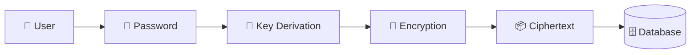
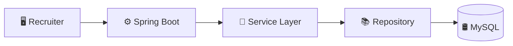
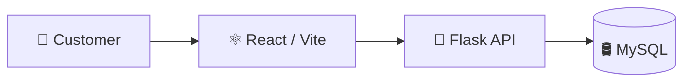
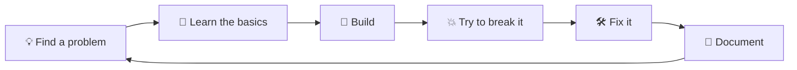

## 👋 About Me

I'm **Neeraj**, a **Computer Science graduate from KL University**, with a **B.Tech in CSE (2026)** and a **CGPA of 9.33**.

I mainly work with **Java, Spring Boot, Python and Flask**, with a strong interest in **backend development, REST APIs and application security**.

I enjoy understanding what happens behind the screen — how a request moves through an API, how data reaches a database, how authentication works, and what happens when someone tries to break those assumptions.

I've deployed my projects on **Oracle Cloud**, and I'm currently looking for a **full-time fresher / graduate role in backend development**, especially roles involving **Java, Spring Boot, APIs and secure systems**.

## 🧰 Skills

 

|     | Skill                                     | Where I've used it                                                                 |
| :-: | ----------------------------------------- | ---------------------------------------------------------------------------------- |
|  ☕  | **Java · Spring Boot**                    | RecruiterService — backend APIs, business logic, MySQL integration, Docker deployment            |
|  🐍 | **Python · Flask**                        | ZK-Vault, food-ordering backend and cybersecurity projects                         |
|  🔐 | **Application Security**                  | Authentication, authorization, secure sessions, input validation and security labs |
|  🌐 | **REST APIs**                             | Spring Boot and Flask backend projects                                             |
| 🗄️ | **MySQL · PostgreSQL · Redis**            | Relational data, application persistence and temporary state                       |
|  ⚛️ | **React · JavaScript · HTML · CSS**       | Food-ordering interface and Network Monitor dashboard                              |
|  🐳 | **Docker · Linux · Git · GitHub Actions** | Containerizing RecruiterService, CI builds and project workflows                   |
|  ☁️ | **Oracle Cloud · AWS · GCP**              | Oracle Cloud deployment of RecruiterService and the food platform; AWS/GCP fundamentals |

### Other tools I work with

**Postman · JUnit · Maven · GitHub Actions · JSP · Bootstrap · Nginx · Linux**

## 🛠️ What I Built

### 🔐 ZK-Vault — Private Data Vault

**Built with:** `Python` `Flask` `MySQL` `Redis` `AES-GCM` `Argon2id`

A personal vault where data is encrypted before the server stores it, so the server can't read it.

**Taught me:** deciding what the server may know, what it must never receive, and where keys live.

🔗 [ZK-Vault](https://github.com/neerajsait/ZK-Vault)

---

### 💼 RecruiterService — Recruitment Management System

**Built with:** `Java` `Spring Boot` `Hibernate / JPA` `MySQL` `JSP` `JavaMail` `JUnit` `Docker` `GitHub Actions` `Oracle Cloud`

The recruiter module of a Campus Recruitment Portal. It started as an **academic team project built as microservices** and was later **combined into a monolith** (main repo: [JFSDSDPProject](https://github.com/neerajsait/JFSDSDPProject)). I built the **Recruiter module**, then took it out as a **standalone service**, containerized it with Docker and deployed it on **Oracle Cloud**.

* Recruiter login, dashboard, job postings and tasks
* CSRF protection, CSP with nonces, OTP-based password recovery
* JUnit/Mockito test suite, Actuator health endpoints and GitHub Actions CI

> This standalone version is maintained by me and may differ from the main team repo, mainly in the UI.

**Taught me:** structuring a Java backend into controllers, services and repositories, and taking a module from code to a live deployment.

🔗 [Standalone service](https://github.com/neerajsait/RecruiterService) · 👥 [Main team repo](https://github.com/neerajsait/JFSDSDPProject) · 🌐 [Live demo](https://trees-diego-elections-aquarium.trycloudflare.com/) · ☁️ Deployed on Oracle Cloud

---

### 🍱 Food Ordering Platform — Suggula's Kitchen

**Built with:** `React` `Vite` `Flask` `MySQL` `Netlify` `Supabase` `Oracle Cloud`

A real food-ordering app covering customers, admin, kitchen and outlet workflows.

**Taught me:** connecting frontend, backend, database and business rules without trusting the client.

🔗 [Source code](https://github.com/neerajsait/FoodPilot) · 🌐 [Customer app](https://foodpilot-customer.netlify.app/) · 🛠️ [Admin & staff portal](https://food-pilot.netlify.app/) · ☁️ Deployed on Oracle Cloud

## 🏆 Certifications

* ☁️ **AWS Certified Cloud Practitioner (CLF-C02)**
* 📮 **Postman API Fundamentals**

## 🔄 How I Work

I don't want to stop at **"it works."** I try to understand **why it works, how it can fail, and what happens when someone sends something I didn't expect**.

* **Build first, then break it.** I write the feature, then attack it myself: bad input, wrong user, broken session, missing token.
* **Keep decisions on the server.** Validation, permissions and business rules never depend on what the client says.
* **Small layers, clear responsibilities.** Controllers handle requests, services hold the logic, repositories talk to the database.
* **Learn by doing.** I pick up a concept, put it into a project, and write down what went wrong.
* **Document as I go.** Every project gets a README explaining what it does and what I learned.

**Beyond the main projects:**

* 🛡️ **[Cybersecurity Projects](https://github.com/neerajsait/cybersecurity-projects)** — deliberately vulnerable examples I attack in a controlled setup, then fix. They cover authentication bypass, injection, session handling and input validation.
* 📡 **[Network Monitor](https://github.com/neerajsait/Network-Monitor)** — a browser dashboard (HTML, CSS, JavaScript) that makes network activity easier to read than raw terminal output.

That mindset is why I'm drawn to the overlap between **backend development and cybersecurity**.

## 📈 My Journey

|     | Stage               | What changed                                                                           |
| :-: | ------------------- | -------------------------------------------------------------------------------------- |
|  🌱 | **Programming**     | Started with programming fundamentals and gradually moved into Java and Python         |
|  🌐 | **Web Development** | Learned HTML, CSS and JavaScript and started building web applications                 |
|  ☕  | **Backend**         | Moved deeper into Java, Spring Boot, REST APIs and MySQL                               |
|  🔐 | **Security**        | Started exploring application security, cryptography and security testing              |
| 🛠️ | **Real Projects**   | Built projects connecting frontend, backend, databases and real business workflows     |
|  ☁️ | **Deployment**      | Deployed projects on Oracle Cloud and made them available as live applications         |
|  🚀 | **Now**             | Strengthening Java/Spring Boot, backend architecture, APIs and cybersecurity knowledge |

I'm less interested in collecting technologies and more interested in understanding **how they actually work together in a real system**.

## 🎯 What I'm Looking For

I'm looking for a **full-time fresher / graduate software engineering role** where I can work on real backend systems and learn from experienced engineers.

### Roles I'm targeting

* **Java Developer**
* **Spring Boot Developer**
* **Backend Engineer**
* **Software Development Engineer / SDE-1**
* **Graduate Engineer Trainee – Technology / API Development**

**Interested in:** Java · Spring Boot · REST APIs · Backend Systems · Databases · Distributed Systems · Application Security

## 📬 Let's Talk

